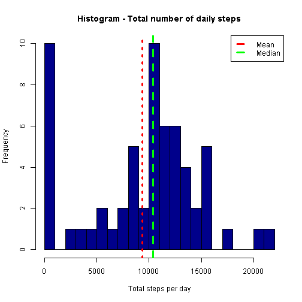
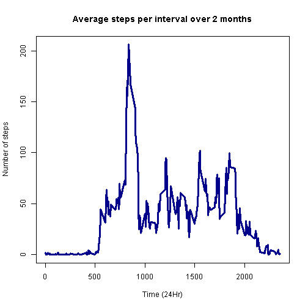
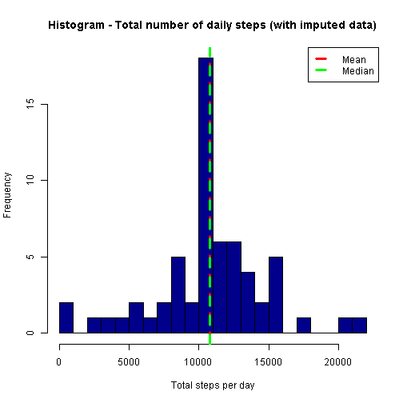
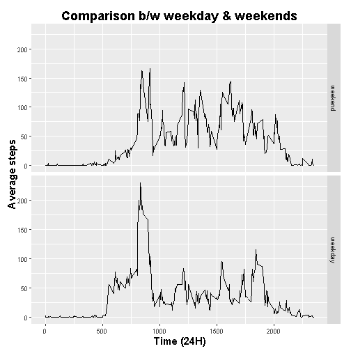

**Assumptions & Notes about the analysis:**
+ Histogram of total number of steps a day implies frequency distribution of number of steps completed per day (i.e. in 61 days how many times has the subject walked 10k steps ?)
+ Each section has the corresponding answers to the question posed
+ Average steps across all days implies for a given interval, what is the average steps completed over all days
+ Missing values have been imputed using average steps across all days for a given interval as explained above (more details on the strategy in the corresponding section)
+ In the calculation of the mean **__(Section 1, question 3)__**, the days with NA values are represented by 0 steps, this causes the mean to skew to the left more than if those days were omitted. 


```r
# Define Libraries that might be used in the analysis
library(ggplot2)
library(dplyr)
library(lubridate)
library(knitr)
```
***
### **Reading in the Data**
##### **1. Code for reading in the dataset and/or processing the data**

```r
# Check if data exists, then set directory & read in data
# if(!exists('Data_0')) { rm(list=ls())
# setwd('C:/Documents/Coursera/CS_5_RR_ST/Assignment1/repdata-data-activity')
# Data_0<-read.csv('activity.csv',header=TRUE,sep = ',') }
filename <- "activity/activity.csv"
Data_0 <- read.csv(filename, header = TRUE, sep = ",")
```
### **Preprocessing the data**

```r
# remove any NA values in the data by using complete cases
cc <- complete.cases(Data_0)
Data_1 <- Data_0[cc, ]
```
***
***
### **Section 1**
##### **2. Histogram of the total number of steps taken each day**
##### **3. Mean and median number of steps taken each day**

```r
# Split the data based on date and sum the steps to get total number of
# steps per day Mean of total steps Median of total steps
Tot_steps <- sapply(split(Data_1$steps, Data_1$date), sum)
Tot_mean <- mean(Tot_steps)
Tot_median <- median(Tot_steps)
# Plot the data as required using the hist() function, add abline for median
# and mean
hist(Tot_steps, breaks = 22, xlab = "Total steps per day", col = "darkblue", 
    main = "Histogram - Total number of daily steps")
abline(v = Tot_mean, col = "red", lwd = 3, lty = 3)
abline(v = Tot_median, col = "green", lwd = 3, lty = 2)
legend("topright", lwd = 3, lty = 2, col = c("red", "green"), legend = c("Mean", 
    "Median"))
```



**Here the plot has a higher number of 0's for the days that have NA values, thus causing the 1st bin (0-1000) to have a higher frequency count, this can be mitigated by using other methods to sum the data (eg. summarise). This also skews the mean to the left of the plot because the divisor is larger.**

```r
  # Output data to the console using the paste print & paste functions
  print(paste0("the mean is ",Tot_mean))
```

```
## [1] "the mean is 9354.22950819672"
```

```r
  print(paste0("the median is ",Tot_median))
```

```
## [1] "the median is 10395"
```

***
***
### **Section 2**
##### **4. Time series plot of the average number of steps taken**
##### **5. The 5-minute interval that, on average, contains the maximum number of steps**

```r
# Use the group by funcntion to group the data by interval, calculate
# average steps using summarise() Find the max average step value and
# identify the interval associated with it.
grp2 <- group_by(Data_1, interval)
Avg_Steps <- summarise(grp2, Int_Avg = mean(steps))
Max_int <- which(Avg_Steps$Int_Avg == max(Avg_Steps$Int_Avg))
Max_Avg_Steps_Int <- Avg_Steps$interval[Max_int]

# Plot the data as required using the plot() function
plot(Avg_Steps$interval, Avg_Steps$Int_Avg, ylab = "Number of steps", xlab = "Time (24Hr)", 
    col = "darkblue", main = "Average steps per interval over 2 months", type = "l", 
    lwd = 3)
```



```r
# Output data to the console using the paste print & paste functions
print(paste0("On average, the ", Max_int, "th interval or ", Max_Avg_Steps_Int, 
    " AM contains the max number of steps."))
```

```
[1] "On average, the 104th interval or 835 AM contains the max number of steps."
```
***
***
### **Section 3**
##### **6. Code to describe and show a strategy for imputing missing data**
##### **7. Histogram of the total number of steps taken each day after missing values are imputed**

```r
# Calculate the number of missing values in the original data, report it using the print & paste function
  Mis_val<-length(cc[cc==FALSE])
  print(paste0("There are ",Mis_val," missing values in the original dataset."))
```

```
[1] "There are 2304 missing values in the original dataset."
```
### **Strategy for imputing data**
 1. Store the original data __*(Data_0)*__ with NA values to a new variable__*(Data_2)*__, 
 2. iterate thru the rows looking for NA values __*(for loop)*__
 3. for whichever interval there exists an NA value __*(if loop, is.na)*__, 
 4. replace it with an average value for that interval over all days __*(Section 2, Avg_Steps)*__

```r
Data_2 <- Data_0
for (i in 1:nrow(Data_2)) {
    if (is.na(Data_2$steps[i] == TRUE)) {
        Data_2$steps[i] <- Avg_Steps$Int_Avg[Avg_Steps$interval == Data_2$interval[i]]
    }
}

# Data_2 is the new dataset with imputed values Split the data based on date
# and sum the steps to get total number of steps per day Mean of total steps
# Median of total steps

Tot_steps_Imp <- sapply(split(Data_2$steps, Data_2$date), sum)
Tot_mean_Imp <- mean(Tot_steps_Imp)
Tot_median_Imp <- median(Tot_steps_Imp)

# plot the data as required using the hist() function, add abline for median
# and mean
hist(Tot_steps_Imp, breaks = 22, xlab = "Total steps per day", col = "darkblue", 
    main = "Histogram - Total number of daily steps (with imputed data)")
abline(v = Tot_mean_Imp, col = "red", lwd = 3, lty = 3)
abline(v = Tot_median_Imp, col = "green", lwd = 3, lty = 2)
legend("topright", lwd = 3, lty = 2, col = c("red", "green"), legend = c("Mean", 
    "Median"))
```



***
***
### **Section 4**
##### **8. Panel plot comparing the average number of steps taken per 5-minute interval across weekdays and weekends**
##### **9. All of the R code needed to reproduce the results (numbers, plots, etc.) in the report**

```r
# Create new varible Data_3 from Data_2
 Data_3<-Data_2
# Convert date to Posix variable using strptime() 
 Data_3$date<-strptime(Data_3$date,format="%Y-%m-%d")
# Define a new column with the weekday for corresponding date
 Data_3<-mutate(Data_3,Day=weekdays(date))
# Define a variable with all the names of the weekdays
 wekdy<-c('Monday','Tuesday','Wednesday','Thursday','Friday')
# Create a new column with the factor of the day- weekday or weekend
 Data_3$class<-factor((Data_3$Day %in% wekdy),levels=c(FALSE,TRUE),labels=c('weekend','weekday'))
# Select relevant variables for analysis & plotting
 Data_4<-select(Data_3,steps,interval,Day,class)
# Group data by interval and class 
 grp1<-group_by(Data_4,interval,class)
# Summarise the data to obtain mean steps over intervals for weekdays and weekends
 Data_5<-summarise(grp1, avg_steps=mean(steps))
 
# Use ggplot and create panel plot with required data
 g<-ggplot(Data_5,aes(interval,avg_steps))
 p<-g+geom_line()+facet_grid(class~.)+
    labs(title="Comparison b/w weekday & weekends")+
    labs(y="Average steps")+labs(x="Time (24H)")+
    theme(axis.title.x = element_text(face="bold"))+
    theme(axis.title.y = element_text(face="bold"))+
    theme(title= element_text(face="bold",size=15))+
    theme( plot.margin =unit(c(1, 1, 0.5, 0.5), "lines"))
 print(p)
```



***
***
